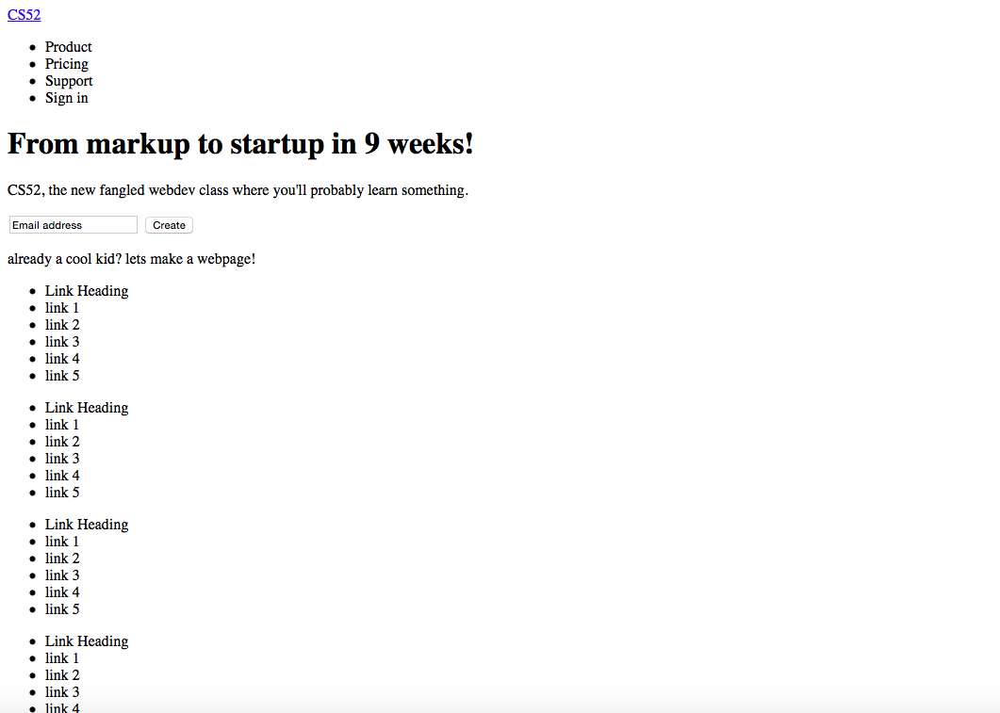
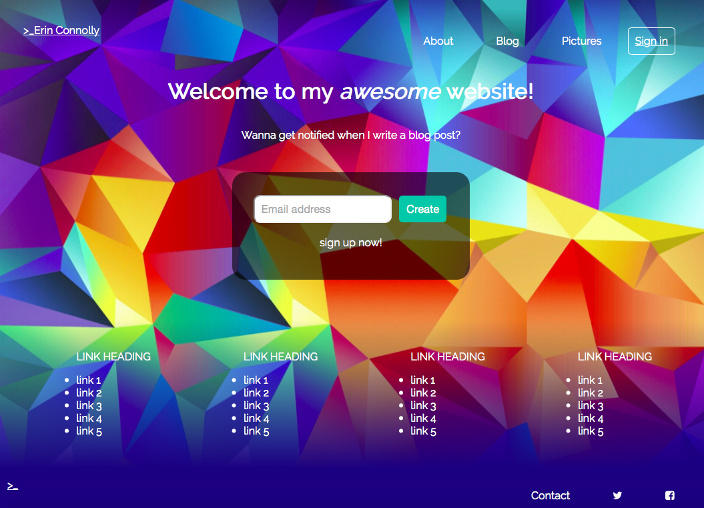

# My Slack-style Landing Page

## Erin Connolly

## Description
On this page, I used only HTML and CSS to create a landing page for a sample personal website using Slack's landing page as a template. Not everything is functional because this was just an example, but it was a good way to practice combining syntax and style with HTML and CSS. For example, here is a screen shot of my page when I laid out the contents in pure html.

And here is what it looks like after adding in complete CSS (with a few content changes as well).

I really enjoyed using flexboxes and think I have the hang of how they work now, and resizing using media queries was tricky at first but looks great. I collapsed the menu and link headings a the bottom and used flex to stack the elements including the email boxes.

I had difficulty for a while keeping the footer at the bottom of the page, but ended up using flex to make it stay there. I think I could have kept a little more organized in my html and css file because when trying to solve problems like the sticky footer, I could get confused on which classes and divs were inside which. I also worked hard to get the gradient you see in the screen shot of the full sized css complete version, and I'm proud of how my site ended up!
